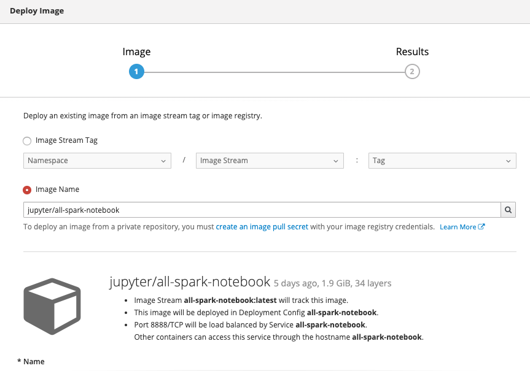

# Deployments examples

## Deploy Jupyter lab

See [this note](https://blog.openshift.com/jupyter-openshift-part-2-using-jupyter-project-images/) to deploy Jupyter lab lastest image to Openshift using the Deploy Image choice. The deployment is done under the project `reefer-shipment-solution`




The environment variable needs to be set to get Jupyter lab. 


It takes multiple minutes to deploy. For the permission error due to the jovyan user not known, the command was:

```
oc adm policy add-scc-to-user anyuid -z default -n reefer-shipment-solution
```

```
 oc get routes
NAME  HOST/PORT   PATH      SERVICES                PORT       TERMINATION   WILDCARD
jupyterlab              jupyterlab-reefer-shipment-solution.greencluster-fa9ee67c9ab6a7791435450358e564cc-0001.us-east.containers.appdomain.cloud    all-spark-notebook   8888-tcp      None
```

Get the secuity token to login in via the pod logs.

```
oc get pods 
NAME                             READY     STATUS      RESTARTS   AGE
all-spark-notebook-2-z4dqx  
```

```
oc logs all-spark-notebook-2-z4dqx 
```

To avoid loosing the work on the notebook, we need to add PVC to `/home/jovyan/work` mount point

```
oc get dc

oc set volume dc/all-spark-notebook  --add --mount-path /home/jovyan/work --claim-size=1G
```
