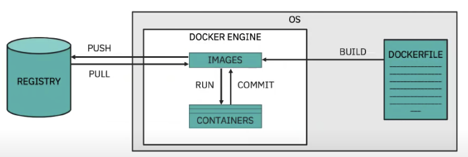

# Quick docker summary

## Why

Lower memory consumption than VM. Define configuration, dependencies, command as file (Dockerfile). It uses registry to store images. Image is like a VM image. Container is a running instance of an image. Docker engine helps to manage the life cycle and commands on a local machine.



### Value propositions for container

Just to recall the value of using container for the cloud native application are the following:

* Docker ensures consistent environments from development to production. Docker containers are configured to maintain all configurations and dependencies internally.
* Docker containers allows you to commit changes to your Docker image and version control them. It is very easy to rollback to a previous version of your Docker image. This whole process can be tested in a few minutes.
* Docker is fast, allowing you to quickly make replications and achieve redundancy.
* Isolation: Docker makes sure each container has its own resources that are isolated from other containers
* Removing an app/ container is easy and won’t leave any temporary or configuration files on your host OS.
* Docker ensures that applications that are running on containers are completely segregated and isolated from each other, granting you complete control over traffic flow and management
The container filesystem is represented as a list of read-only layers stacked on top of each other using a storage driver. The layers are generated when commands are executed during the Docker image build process. The top layer has read-write permissions.
Docker daemon configuration is managed by the Docker configuration file (/etc/docker/daemon.json) and Docker daemon startup options are usually controlled by the systemd unit: `docker`.
With environment variables you can control one container, while using `linked containers` docker automatically copies all environment variables from one container to another.

## Dockerfile

ENTRYPOINT specifies the default command to execute when the image runs in a container
CMD provides the default arguments for the ENTRYPOINT instruction

Example to build a custom Apache Web Server container image.

```dockerfile
FROM ubi7/ubi:7.7
ENV PORT 8080
RUN yum install -y httpd && yum clean all
RUN sed -ri -e "/^Listen 80/c\Listen ${PORT}" /etc/httpd/conf/httpd.conf && \
    chown -R apache:apache /etc/httpd/logs/ && \
    chown -R apache:apache /run/httpd/
USER apache
EXPOSE ${PORT}
COPY ./src/ /var/www/html/
CMD ["httpd", "-D", "FOREGROUND"]
```

[Best practices for writing Dockerfiles](https://docs.docker.com/develop/develop-images/dockerfile_best-practices/)

[Run java using openJDK image](https://hub.docker.com/_/openjdk)


## Some docker and docker compose tricks

### Tricks

* Modify the PATH:  `ENV PATH="/opt/ibm/db2/V11.5/bin:${PATH}"`

### Run a ubuntu image

This could be a good approach to demonstrate a linux based.

```shell
docker run --name my-linux  --detach ubuntu:20.04 tail -f /dev/null
# connect
docker exec -ti my-linux bash
# Update apt inventory and install jdk, maven, git, curl, ... 
apt update
apt install -y openjdk-11-jre-headless maven git curl vim
```

This project includes a Dockerfile-ubuntu to build a local image with the above tools.

```shell
docker build -t jbcodeforce/myubuntu:20.04 -f Dockerfile-ubuntu .
```

### Docker volume

For mounting host directory, the host directory needs to be configured with ownership and permissions allowing access to the container.

```shell
docker run -v /var/dbfiles:/var/lib/mysql rhmap47/mysql
```

### Reclaim disk space

```shell
docker system df
```

(https://rmoff.net/post/what-to-do-when-docker-runs-out-of-space/)

### Docker network

```shell
docker network list
# create a network
docker network create kafkanet
# Assess which network a container is connected to
docker inspect 71582654b2f4 -f "{{json .NetworkSettings.Networks }}"

> "bridge":{"IPAMConfig":null,"Links":null,"Aliases":null,"NetworkID":"7db..."

# disconnect a container to its network
docker network disconnect bridge 71582654b2f4
# Connect an existing container to a network
docker network connect docker_default containernameorid
```

Inside the container the host name is in DNS: `host.docker.internal`. The other solution is to use --network="host" in docker run command, then 127.0.0.1 in the docker container will point to the docker host.

### Start a docker bypassing entry point or cmd

```shell
docker run -ti --entrypoint "/bin/bash" imagename
```

or use the command after the image name:

```shell
docker run -ti imagename /bin/bash 
```

### Docker build image with tests and env variables

Inject the environment variables with --build-arg

```shell
docker build --network host \
            --build-arg KAFKA_BROKERS=${KAFKA_BROKERS} \
            --build-arg KAFKA_APIKEY=${KAFKA_APIKEY} \
            --build-arg POSTGRESQL_URL=${POSTGRESQL_URL}  \
            --build-arg POSTGRESQL_USER=${POSTGRESQL_USER} \
            --build-arg POSTGRESQL_PWD=${POSTGRESQL_PWD} \
            --build-arg JKS_LOCATION=${JKS_LOCATION} \
            --build-arg TRUSTSTORE_PWD=${TRUSTSTORE_PWD} \
            --build-arg POSTGRESQL_CA_PEM="${POSTGRESQL_CA_PEM}"  -t ibmcase/$kname .

```

## Docker compose

Docker compose helps to orchestrate different docker container and isolate them with network. Examples of interesting docker-compose file:

* [Kafka Strimzi](https://github.com/jbcodeforce/kafka-studies/blob/master/docker-compose.yml)
* [Kafka Confluent]()
* [Flink]()

* An interesting option to start the container is to build the image if it does not exist:

 ```shell
 docker-compose -f docker-compose-db2.yaml up --build
# where the declaration includes
db2server:
    image: debezium/db2-cdc:${DEBEZIUM_VERSION}
    build:
      context: ./debezium-db2-init/db2server
    ...
 ```

 See [this note for the build declaration](https://docs.docker.com/compose/compose-file/#build).
