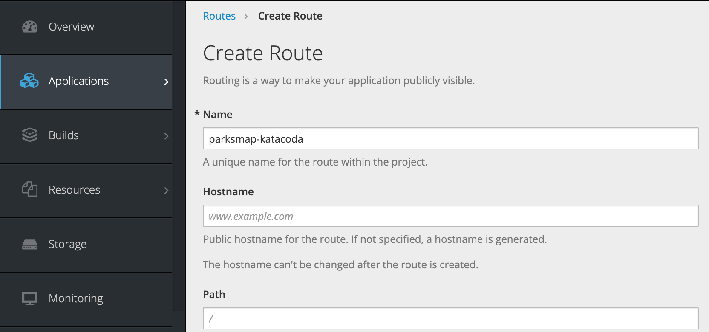

# OpenShift Studies

OpenShift Container Platform is to develop, deploy, and run containerized applications, it is based on docker and kubernetes with added features like:

* routes: represents the way external clients are able to access applications running in OpenShift
* deployment configs 
* CLI, [REST API](https://docs.openshift.org/latest/rest_api/index.html) for administration or Web Console, and [Eclipse plugin](https://tools.jboss.org/features/openshift.html).
* built to be multi tenants. You can also grant other users access to any of your projects. 
* Use the concept of project to allow for controlled accesses and quotas for developers. Projets are mapped to k8s namespaces.
* [Source-to-image (S2I)](https://docs.openshift.org/latest/creating_images/s2i.html) is a tool for building reproductible Docker images. S2I supports incremental builds which re-use previously downloaded dependencies, and previously built artifacts. OpenShift is S2I-enabled and can use S2I as one of its build mechanisms.
* OpenShift for production comes in several variants:
    * OpenShift Origin: from [http://openshift.org](http://openshift.org)
    * OpenShift Container Platform: integrated with RHEL and supported by RedHat. It allows for building a private or public PaaS cloud 
    * OpenShift Online: multi-tenant public cloud managed by Red Hat
    * OpenShift Dedicated: single-tenant container application platform hosted on Amazon Web Services (AWS) or Google Cloud Platform and managed by Red Hat.

The way that external clients are able to access applications running in OpenShift is through the OpenShift routing layer. The default OpenShift router (HAProxy) uses the HTTP header of the incoming request to determine where to proxy the connection. 

## Concepts

Openshift is based on kubernetes. It adds the concept of project, mapped to a k8s namespace, to govern the application access control, resource quota and life cycle. It is the top-level element for an application.

We can deploy any docker image  as soon as they are well built: such as defining the port any service is exposed on, not needing to run specifically as the root user or other dedicated user, and which embeds a default command for running the application.

The default OpenShift router (HAProxy) uses the HTTP header of the incoming request to determine where to proxy the connection. 

Routes defines hostname, service name, port number and TLS settings:



Routes are used to expose app over HTTP. OpenShift can handle termination for secure HTTP connections, or a secure connection can be tunnelled through direct to the application, with the application handling termination of the secure connection. Non HTTP applications can be exposed via a tunnelled secure connection if the client supports the SNI extension for a secure connection using TLS.

## Getting started

We can use minishift on laptop to play with openshift one node.

We can also use [openshift online](https://docs.openshift.com/online/getting_started/basic_walkthrough.html) 

## Deploying App

Three main methods to add an app to openshift:

* Deploy an application from an existing Docker-formatted image. (Using `Deploy Image` in the project view.)


!!! note
        There are two options: 

        * from an image imported in the openshift cluster, or built from a dockerfile inside the cluster. 
        * by accessing a remote image repository like `Dockerhub`. The image will be pulled down and stored within the internal OpenShift image registry. The image will then be copied to any node in the OpenShift cluster where an instance of the application runs.

        Application will, by default, only be visible internally to the OpenShift cluster, and usually only to other applications within the same project. Use `Create route` to make the app public. 

        See some examples [here](deployment-ex.md)


* Build and deploy from source code contained in a Git repository using a [Source-to-Image](https://github.com/openshift/source-to-image) toolkit. 

    

    See [this video to get s2i presentation](https://www.youtube.com/watch?v=flI6zx9wH6M) and [this section](#s2i) goes to a simple Flask app deploy with s2i. 

* Build and deploy from source code contained in a Git repository from a Dockerfile.

## Collaborate

User can be added to an existing project, via the View membership menu on a project. Each user can have different roles. `Edit Role` can perform most tasks within the project, except tasks related to administration of the project.

!!! Remark
    state about the current login session is stored in the home directory of the local user running the `oc` command, so user need to logout and login to the second cluster he wants to access. 

You can get a list of all OpenShift clusters you have ever logged into by running:

```
oc config get-clusters
```

## s2i

Source to image toolkit aims to simplify the deployment to openshift. It uses a build image to execute an assemble script that builds code and docker image without Dockerfile.  From an existing repository, `s2i create` add a set of elements to define the workflow into the repo. For example the command below will add Dockerfile and scripts to create a build image named `ibmcase/buildorderproducer` from the local folder where the code is.

```
s2i create ibmcase/buildorderproducer .
```

When the assemble script is done, the container is committed to internal repository. The CMD part of the dockerfile execute a run script.

Here is another command to build the output image using existing build image on local code:

```
s2i build --copy .  centos/python-36-centos7 ibmcase/orderproducer
```

!!! Note
    s2i takes the code from git, so to use the local code before commmitting it to github, add the `--copy` argument.


## ODO: Openshift Do

A CLI for developer to abstract kubernetes. [odo](https://www.katacoda.com/openshift/courses/introduction/developing-with-odo) can build and deploy your code to your cluster immediately after you save your changes.

List existing software catalog deployed on a cluster:

```
odo catalog list components
```

To create a component (create a config.yml) from a java springboot app, once the jar is built:

```
odo create java backend --binary target/wildwest-1.0.jar
```

To see the config:
```
odo config view
```
Then to deploy it to openshift:

```
odo push
```

OpenShift provides mechanisms to publish communication bindings from a program to its clients. This is referred to as linking.

```
odo link backend --component frontend --port 8080
```

See [odo github](https://github.com/openshift/odo)