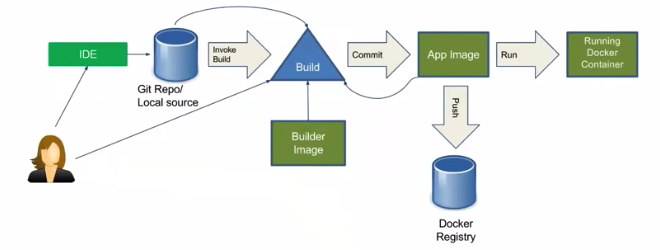

# oc cheat sheet 

oc is a tool written in Go to interact with an openshift cluster (one at a time). State about the current login session is stored in the home directory of the local user running the oc command.

### Login

```
oc login --username collaborator --password collaborator 
```

Log in to your server using a token for an existing session.

```
oc login --token <token> --server=https://<>.us-east.containers.cloud.ibm.com:21070
```

Get api version

```
oc api-versions
```

To assess who you are and get login userid:
```
oc whoami
```

See what the current context: 
```
oc whoami --show-context
```

verify which server you are logged into

```
oc whoami --show-server
```

Even if logged as a non admin user, we can still execute some command as admin, if the user is a sudoer:

```
oc get projects --as system:admin
```

### Cluster

See cluster:

```
oc config get-clusters
```

Show a list of contexts for all sessions ever created. For each context listed, this will include details about the project, server and name of user, in that order

```
oc config get-contexts
```

Proxy the API server

```
oc proxy --port=8001

curl -X GET http://localhost:8001/api/v1/namespaces/myproject/pods
```

#### Persistence volume

```
oc get pv --as system:admin
```

Add a storage class


#### Add access for a user to one of your project

```
oc adm policy add-role-to-user view developer -n myproject
> role "view" added: "developer"
```

The role could be `edit | view | admin`

#### Add user


### Project commands

Select a project once logged to openshift:
```
oc project <projectname>
```

Get the list of projects

```
oc get projects
```

Get the list of supported app templates:

```
oc new-app -L
```

To create a project, that is mapped to a kubernetes namespace:

```
$ oc new-project <project_name> --description="<description>" --display-name="<display_name>"
```

To see a list of all the resources that have been created in the project:

```
oc get all -o name
```

If you need to run a container from an image that needs to be run as root, then grant additional provilieges to the project:

```
oc adm policy add-scc-to-user anyuid -z default -n myproject --as system:admin
```

Verify the Deployment has been created: `oc get deploy`

Verify the ReplicaSet has been created: `oc get replicaset`

Verify the pods are running: `oc get pods`

#### Custom Resource Definition

See [this training](https://learn.openshift.com/operatorframework/etcd-operator/)

```
oc get crd
```

Get service account: Service accounts provide a flexible way to control API access without sharing a regular user’s credentials. Every service account has an associated user name that can be granted roles. Default, builder, deployer are defined in each project)

```bash
oc get sa
> builder
default
deployer
jb-kafka-cluster-entity-operator  
jb-kafka-cluster-kafka
jb-kafka-cluster-zookeeper
strimzi-cluster-operator
strimzi-topic-operator
```

As soon as a service account is created (`oc create sa strimzi-cluster-operator`), two secrets are automatically added to it:

* an API token
* credentials for the OpenShift Container Registry

Access to the roles defined in a project
```
oc get roles
> strimzi-topic-operator
> 
oc get rolebindings
```

#### Work with images

Search a docker image and see if it is valid:

```
oc new-app --search openshiftkatacoda/blog-django-py
```

Deploy an image to a project and link it to github:
```
oc new-app --docker-image=<docker-image> [--code=<source>] --name myapp
```

The image will be pulled down and stored within the internal OpenShift image registry. You can list what image stream resources have been created within a project by running the command:

```
oc get imagestream -o name
``` 

#### Expose app

To expose the application created so it is available outside of the OpenShift cluster, you can run the command:

```
oc expose service/blog-django-py
```

To view the hostname assigned to the route created from the command line, you can run the command:

```
oc get route/blog-django-py
```


Or by using a label selector: 
```
oc get all --selector app=blog-django-py -o name
```

Get detail of a resource:

```
oc describe route/blog-django-py
```

Deleting an application and all its resources, using label:

```
oc delete all --selector app=blog-django-py
```

To import an image without creating a container: 
```
oc import-image openshiftkatacoda/blog-django-py --confirm
```

Then to deploy an instance of the application from the image stream which has been created, run the command:
```
oc new-app blog-django-py --name blog-1
```

List what image stream resources have been created within a project by running the command:

```
oc get imagestream -o name
```


Create an app from the source code, and use source to image build process to deploy the app:

```
oc new-app python:latest~https://github.com/jbcodeforce/order-producer-python -name appname
```

other example with context directory:
```
oc new-app https://github.com/jbcodeforce/refarch-kc-order-ms --context-dir=order-command-ms/
```

Then to track the deployment progress:
```
oc logs -f bc/<appname>
```
The dependencies are loaded, the build is scheduled and executed, the image is uploaded to the registry, and started. See the workflow in the diagram below.



The first time the application is deployed, if you want to expose it to internet do:

```
oc expose service/<appname>
```

When using source to image approach, it is possible to trigger the build via:

```
oc start-build app-name
```

You can use oc logs to monitor the log output as the build runs. You can also monitor the progress of any builds in a project by running the command:

```
oc get builds --watch
```

To trigger a binary build, without committing to github, you can use the local folder to provide the source code:

```
oc start-build app-name --from-dir=. --wait
```

*The --wait option is supplied to indicate that the command should only return when the build has completed.*

Switch back to minishift context:

```
oc config use-context minishift
```


