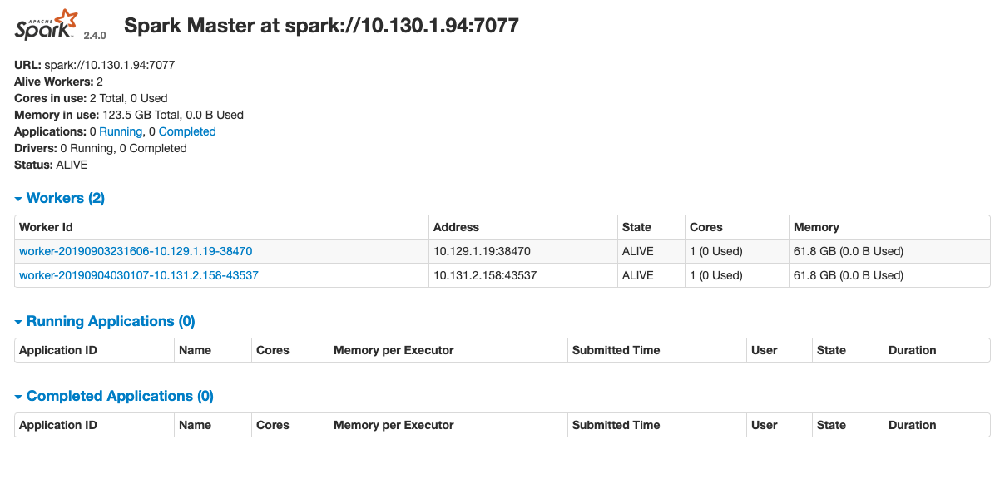
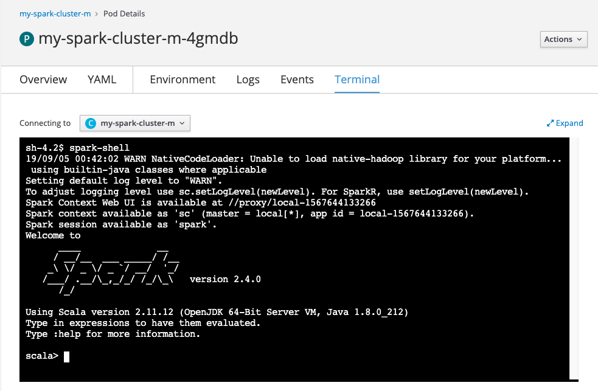

# Kubernetes Operators

## Operators

Operators make it easy to manage complex stateful applications on top of Kubernetes. They are custom resource definition in kubernetes. See the framework [here](https://github.com/operator-framework).

Operator SDK is a framework to expose higher level APIs to write operational logic.

Here is a workflow for a new Go-based Operator using the Operator SDK:

* Create a new Operator project using the SDK CLI.

    ```
    operator-sdk new podset-operator --type=go --skip-git-init
    ```

* Create a new Custom Resource Definition API Type using the SDK CLI.

    ```
    operator-sdk add api --api-version=app.example.com/v1alpha1 --kind=PodSet
    ```

* Add your Custom Resource Definition (CRD) to your live Kubernetes cluster.
* Define your Custom Resource Spec and Status.
* Create a new Controller for your Custom Resource Definition API.
* Write the reconciling logic for your Controller.
* Run the Operator locally to test your code against your live Kubernetes cluster.
* Add your Custom Resource (CR) to your live Kubernetes cluster and watch your Operator in action!
* After you are satisifed with your work, use the SDK CLI to build and generate the Operator Deployment manifests.
* Optionally add additional APIs and Controllers using the SDK CLI.

A namespace-scoped operator (the default) watches and manages resources in a single namespace, whereas a cluster-scoped operator watches and manages resources cluster-wide.

!!! note
        TBC

## Spark on openshift using operator

The following spark operator from : `git clone https://github.com/radanalyticsio/spark-operator.git` supports both config map or custom resource definition to deploy spark cluster on kubernetes. It works well in environments where a user has a limited role-based access to Kubernetes, such as OpenShift.

See also [this note on user identity](https://spark.apache.org/docs/latest/running-on-kubernetes.html#user-identity). 

You need a custom spark docker image to set userid and pod security policies. 

### Spark operator

To deploy the spark operator, use one of the yaml file (with CRD or with configMap)

```bash
kubectl apply -f manifest/operator.yaml 

or

kubectl apply -f manifest/operator-cm.yaml 
```

### Spark cluster

Once the operator is deployed, configure your spark cluster using one of the yaml examples

```
cd examples
kubectl apply -f cluster.yaml 
or

kubectl apply -f cluster-cm.yaml 
```


Once you don't need the cluster anymore, you can delete it by deleting the custom resource by:
```bash
kubectl delete sparkcluster my-spark-cluster
```

### Exposing the spark UI

Create a route for the Spark UI:

* go to the service to get the exposed port for the my-spark-cluster-ui service. 
* In network> routes add the roule with the following yaml:

```yaml
apiVersion: route.openshift.io/v1
kind: Route
metadata:
  name: expose-spark-ui
  namespace: greencompute
spec:
  path: /
  to:
    kind: Service
    name: my-spark-cluster-ui
  port:
    targetPort: 8080
```

Then going to the exposed URL will bring the basic spark user interface, helpful to get visibility on the running and completed application, and the workers state.



### Test with spark terminal and scala

Go to one of the spark worker pod, in the Workloads menu, then go to the Terminal and enter:

```
spark-shell
```

you should now be in scala interpretor. Spark’s shell provides a simple way to learn the API, as well as a powerful tool to analyze data interactively.



The simple exercise will be to count the number of word occurence in a file. First connect to one of the spark pod using kubectl or oc.

```
oc get pods
NAME                             READY     STATUS    RESTARTS   AGE
my-spark-cluster-m-4gmdb         1/1       Running   0          1d
my-spark-cluster-w-jh9pl         1/1       Running   1          1d
my-spark-cluster-w-mnvkz         1/1       Running   0          1d

oc exec -ti my-spark-cluster-m-4gmdb bash

bash-4.2$ cd /tmp; vi input.txt

enter some sentences
```

In the spark-shell terminal, enter the following scala line of code to connect to spark context (sc) variable, read the file 

```
scala> val inputfile = sc.textFile("input.txt")
inputfile: org.apache.spark.rdd.RDD[String] = input.txt MapPartitionsRDD[1] at textFile at <console>:24
scala> val counts = inputfile. flatMap (line => line. split (" ")).map (word => (word, 1)).reduceByKey (_+_)
counts: org.apache.spark.rdd.RDD[(String, Int)] = ShuffledRDD[6] at reduceByKey at <console>:25
scala> counts.saveAsTextFile ("output")
```

The output is a folder under the /tmp directory. Inside the cluster executor container, we can see the file `cat part-00000 ` that contains the word count.

Spark works!.

See [my other repo on spark studies](https://github.com/jbcodeforce/spark-studies)

The most common way to launch spark applications on the cluster is to use the shell command spark-submit. 
